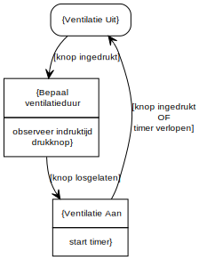

# Bathroom Ventilation

## Introduction

This small project will drive the relais (eg. to run bathroom ventilator, light, ...).
When the button is pressed short (eg. 1 second), the relais will close for about 10 minutes, than automatically stops.
When the button is pressed long (eg. X seconds, where X > 1 second), the amount of seconds will be converted into minutes, and the relais will close for X minutes, then automatically stop.
eg. if you press 3 seconds, relais will close 3 minutes.

## Requirements

### Hardware

1. Arduino Uno-compatible board
2. Relais module (5V high = closed, low = open, mine came from ELEGOO 37-in-1 Arduino starter kit)
3. Switch module (connected using internal pullup)
4. Breadboard + wires
5. 4.7uF Capaciter (optional, for more stable power supply)

### Software

1. Visual Studio Code
   1. Extentions
      1. Arduino
      2. C/C++
      3. YUML (optional)

! make sure to update the `configurations > includePath` in file `.vscode\c_cpp_properties.json`

2. OR Arduino IDE
3. Arduino libraries
   1. Button -> ! modified version
   2. Neotimer (uses millis())
   3. StateMachine
      1. LinkedList

## State Diagram

see: [badkamer_ventilator_v2.yuml](badkamer_ventilator_v2.yuml)
